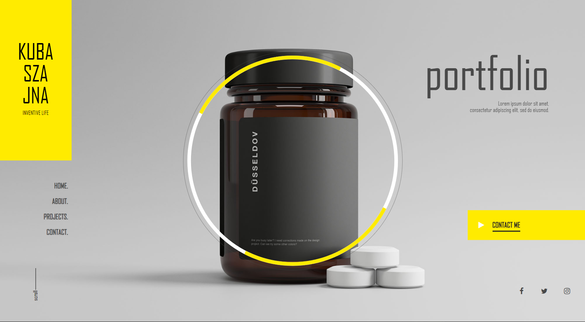
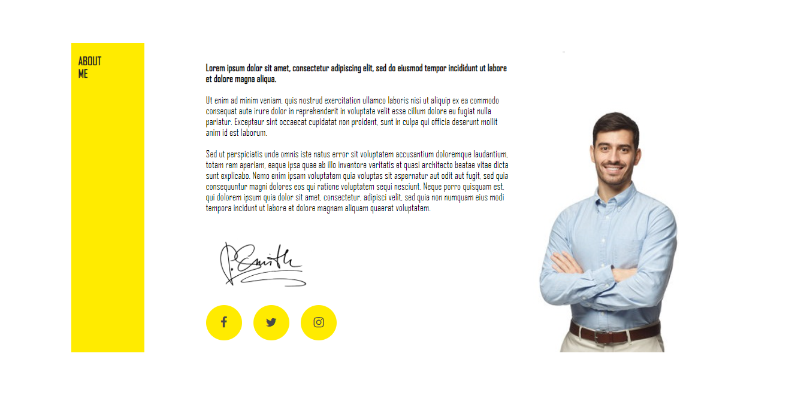
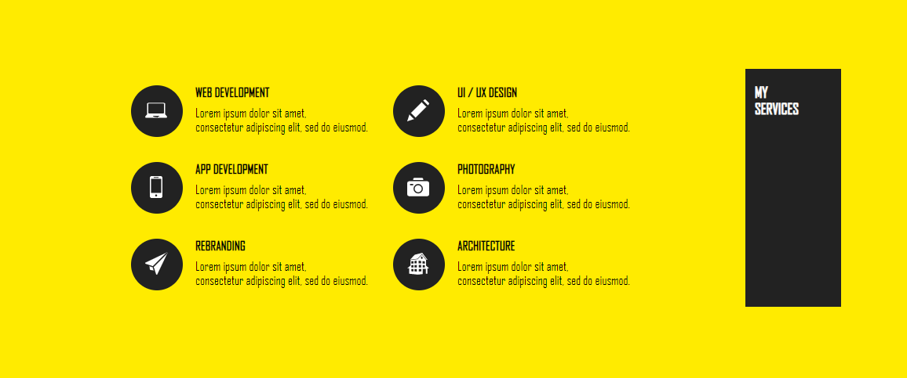
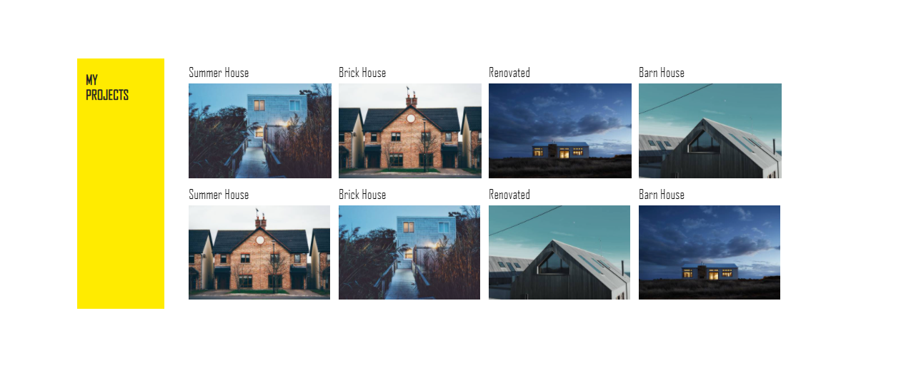
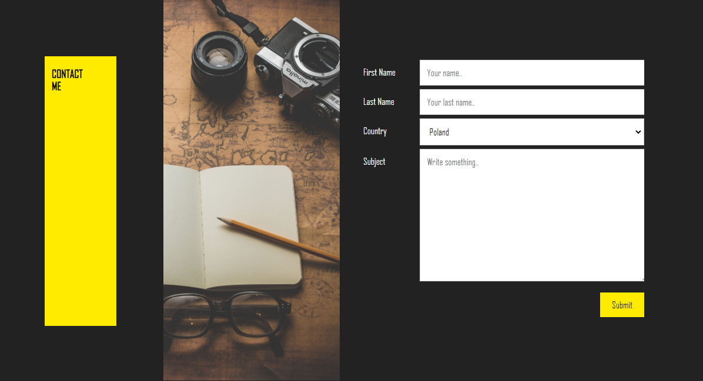

# Projekt HTML & CSS - Wizytówka / Portfolio | [Demo](https://kubaszajna.github.io/CodersCamp2020.Project.HTML-CSS.BusinessCard/)

**Spis treści**
- [Opis Projektu](#opis-projektu)
- [Main](#main)
- [About Me](#about-me)
- [My Services](#my-services)
- [Projects](#projects)
- [Contact](#contact)
- [Demo projektu](https://kubaszajna.github.io/CodersCamp2020.Project.HTML-CSS.BusinessCard/)

## Opis projektu
Projekt strony portfolio został wykonany z wykorzystaniem najlepszych praktyk na związanych z wykorzystaniem HTML oraz CSS. Style zostały utworzone w oparciu o metodologię [BEM](https://en.bem.info/methodology/). Witryna cechuje się także wykorzystaniem animacji keyframes oraz media queries w celu dostosowania projektu do responsywnego wyświetlania w przypadku wszystkich urządzeń. Projekt graficzny został stworzony przeze mnie w oparciu o inspiracje znaleznione na platformie Pinterest.
W projekcie została wykorzystana czcionka Agency FB oraz ikony zewnętrzne [Font Awesome](https://fontawesome.com/).

Breakpoint's odpowiadają rozdzielczościom:
- 600px - Small devices (portrait tablets and large phones)
- 768px - Medium devices (landscape tablets)
- 992px - Large devices (laptops/desktops)
- 1200px - Extra large devices (large laptops and desktops)

## Main
W ramach widoku głównego w części centralnej znajduje się zdjęcie wraz z nałożoną animacją CSS. W lewej kolumnie zlokalizowany jest element z logo oraz menu główne. W prawej kolumnie znajduje się sekcja umożliwiająca dodanie krótkiej notatki, przycisk umożliwiający przeniesienie do sekcji kontaktowej oraz ikony social media.

## About Me 

 W tej sekcji centralnej prezenetowane są podstawowe informacje na temat właściciela jego sygnatura oraz ikony social media. W prawej kolumnie możliwe jest dodanie zdjęcia przedstawiającego autora. Powinny się tutaj znaleźć informacje dotyczące doświadczenia właściciela oraz krótki opis umożliwiający bliższe jego poznanie.
 
 

 ## My Services 

 Ta sekcja prezentuje umiejętności, którymi autor witryny może się pochwalić. Sekcja ta podobnie jak pozostałe została stworzona w oparciu o flexbox.
 
 
 
 ## Projects
 
 W ramach kolejnego widoku, użytkownik ma możliwość zaprezentowania wykonanych przez siebie projektów, a także wyróżnienia tych, które najlepiej prezentują posiadane przez niego umiejętności.
 
 
 
 
 ## Contact
 Ostatni widok pozwala przeglądającemu witrynę skontaktować się z jej właścicielem w celu podjęcia współpracy. W sekcji Contact został stworzony formularz umożliwiający kontakt z informacjami takimi jak Imię, Nazwisko, Kraj oraz Treść. 
 
 

